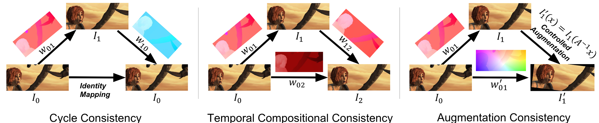

# Tri-Flow

PyTorch implementation of triangular consistency described in:

**Triangular Consistency as A Universal Constraint For Learning Optical Flow**

[[`arXiv`](https://arxiv.org/abs/2606.19938)]

<div align="center">
  
</div>


## Usage

To use triangular consistency in your project, download the ops and augment folders as well as the [tri_flow.py](tri_flow.py) script.

Once this has been done you can implement any of the three losses by simply importing the adequate function from [tri_flow.py](tri_flow.py) and passing the required arguments.

The three functions are

`loss_identity` Returns will return the Cycle Consistency loss as a scalar.

`loss_composition` Returns Temporal Consistency loss as a scalar.

`get_aug_img_flow` Returns the augmented image and composed flow from Image t to augmented Image at t + 1.

The augmented image returned from `get_aug_img_flow` should be used to run inference and calculate the predicted flow. Then this predicted flow can be compared to the analytically composed flow returned from the function in order to obtain the loss.

## Self-Supervised Optical Flow


## Unsupervised Optical Flow

## Supervised Optical Flow

We applied the tri-flow method to the [RAFT](https://github.com/princeton-vl/raft) using a pre-trained model on the **FlyingChairs** and **FlyingThings3D** datasets and applying the augmentation method described in the paper for the rest of the training pipeline. The code implementation is present in the **"Supervised"** folder.

## License

This repository is released under the [MIT LICENSE](LICENSE)

## Citation

If this work is useful in your research, please consider citing it and giving the repository a star :star:

```
@inproceedings{Xiao2026Tri-Flow,
  title={Triangular Consistency as A Universal Constraint For Learning Optical Flow},
  author={Xiao, Yi, and Rodriguez Coronel, Carlos and Zhan, Jing and Oskouie, Haniyeh Ehsani and Wong, Alex and Lao, Dong},
  booktitle={Proceedings of the European Conference on Computer Vision (ECCV)},
  year={2026}
}
```
